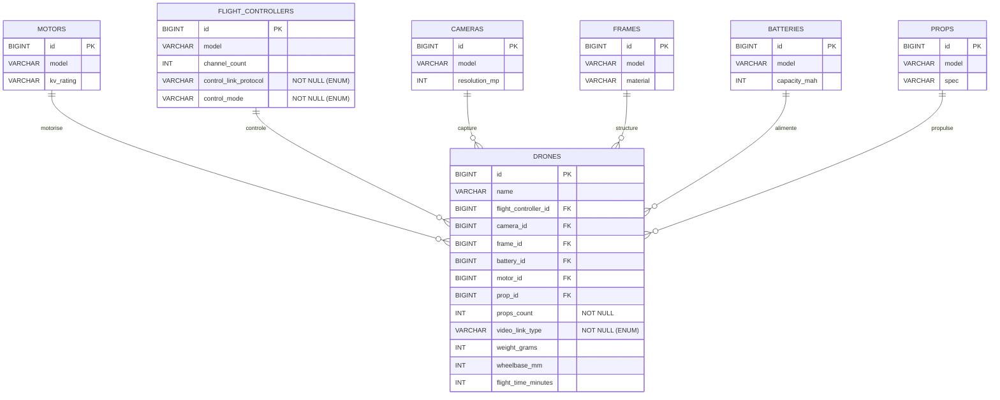

# MCD

## Cardinalites

- MOTOR 0..N DRONES et DRONE 1..1 MOTOR
- PROP 0..N DRONES et DRONE 1..1 PROP
- FLIGHT_CONTROLLER 0..N DRONES et DRONE 1..1 FLIGHT_CONTROLLER
- CAMERA 0..N DRONES et DRONE 1..1 CAMERA
- FRAME 0..N DRONES et DRONE 1..1 FRAME
- BATTERY 0..N DRONES et DRONE 1..1 BATTERY

## ENUM

- video_link_type: ANALOG, DIGITAL
- control_link_protocol: ELRS, CROSSFIRE, FRSKY, SBUS, IBUS, DSMX
- control_mode: ACRO, ANGLE, HORIZON, SELF_LEVEL, HOVER, RTH
