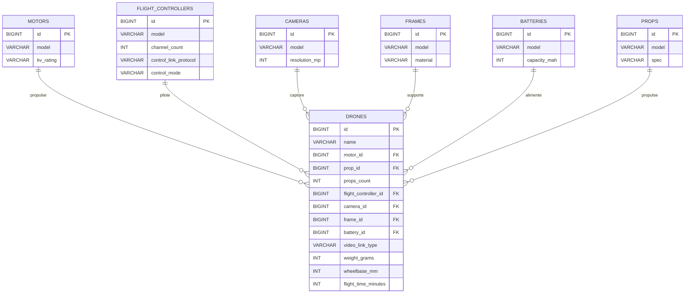

# Livrable Drone Semaine Prochaine

## 1) Code a jour

Le projet contient maintenant 7 entites drone:

1. Battery
2. Camera
3. Drone
4. FlightController
5. Frame
6. Motor
7. Prop

Relations implementees:

- ManyToOne: Drone -> FlightController
- ManyToOne: Drone -> Camera
- ManyToOne: Drone -> Frame
- ManyToOne: Drone -> Battery
- ManyToOne: Drone -> Motor
- ManyToOne: Drone -> Prop
- OneToMany: FlightController -> Drone
- OneToMany: Camera -> Drone
- OneToMany: Frame -> Drone
- OneToMany: Battery -> Drone
- OneToMany: Motor -> Drone
- OneToMany: Prop -> Drone
- Champ metier drone: propsCount
- Champs metier drone: weightGrams, wheelbaseMm, flightTimeMinutes
- Champ metier drone: videoLinkType = ANALOG | DIGITAL
- Champ metier motor: kvRating = 2800KV / 1950KV / 320KV
- Champ metier flight controller: controlLinkProtocol = ELRS | CROSSFIRE | FRSKY | SBUS | IBUS | DSMX
- Champ metier flight controller: controlMode = ACRO | ANGLE | HORIZON | SELF_LEVEL | HOVER | RTH

## 2) Script SQL

Le script de seed est ici:

- sql/seed.sql

Il contient 10 INSERT INTO par entite (7 entites).

Ordre d'insertion choisi pour respecter les cles etrangeres:

1. motors
2. flight_controllers
3. cameras
4. frames
5. batteries
6. props
7. drones

## 3) MCD

